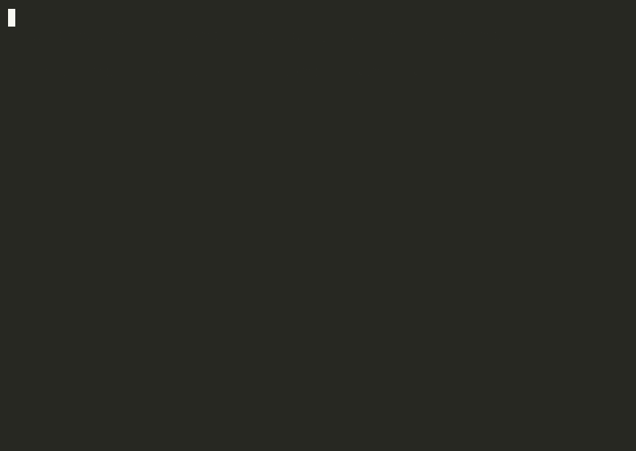

<h1 align="center">wts</h1>

<p align="center">
Create a <a href="https://jj-vcs.github.io/jj/">jujutsu</a> workspace in a sibling folder and open it — in one command.
</p>

<p align="center">
<a href="#how-it-works">How it works</a> &middot;
<a href="#actions">Actions</a> &middot;
<a href="#copying-untracked-files">Copying files</a> &middot;
<a href="#removing-workspaces">Removing</a> &middot;
<a href="#installation">Installation</a>
</p>

<p align="center">
  
</p>
<p align="center"><i>wts creates a workspace and hands it to an action — here, Claude Code.</i></p>

## How it works

```
wts [-r REV] [-n NAME] [-a ACTION]   # create a workspace + run an action in it
wts rm [<name>...]                   # forget + delete workspace(s), or the current one
```

From inside a jj repo, `wts`:

1. Creates a workspace at `<repo>-wts/<name>`, a sibling folder. The name comes
   from `-n`, else the **base revision** — its short change id plus description,
   e.g. `qlvrqrmx-fix-the-login-bug` (just the id if there's no description).
2. Copies any [untracked files you've opted into](#copying-untracked-files) from
   the source workspace.
3. Runs the chosen [action](#actions) in it.

`-r REV` sets the revision the workspace sits on (default: the same parents as
`@`). So from `~/dev/acme`, `wts -n hotfix` creates and opens `~/dev/acme-wts/hotfix`.

## Actions

Each new workspace runs an **action**. Actions are named, configured under
`wts.action.<name>`; each value is a **script path** or the literal **`cd`** (a
built-in that moves your shell into the workspace). `wts` runs `default`, or the
action you pass with `-a`:

```fish
jj config set --user wts.action.default cd                    # bare `wts` cds you in
jj config set --user wts.action.edit ~/.config/wts/edit.fish  # a named script action
```

```
wts -n hotfix            # runs `default`
wts -n hotfix -a edit    # runs `edit`
wts -n hotfix -a cd      # the built-in `cd`, always available
```

- No `-a` runs `default`; if it isn't set, `wts` errors. `-a NAME` for an
  unconfigured name errors too, so typos surface.
- Action tables merge across config layers — a `--repo` action extends your
  `--user` set, and a per-repo `default` overrides the user one.
- A leading `~/` in a script path expands to `$HOME`.

### Writing a script action

A script carries its own shebang (`fish`, `bash`, `python3`, `rust-script`, …)
and gets the new workspace directory three ways: as `$1`, as its working
directory, and as `$WTS_DIR`. It runs attached to your terminal, so it can be
fully interactive — launch an editor, a shell, `claude`, tmux — and anything it
starts runs inside the workspace. Its exit code becomes `wts`'s.

```fish
#!/usr/bin/env fish
# ~/.config/wts/edit.fish — open the workspace in your editor, then a shell
$EDITOR $WTS_DIR &
exec fish
```

### Landing your shell in the workspace

The built-in `cd` moves your shell into the new workspace. A script can't do
that directly (a child can't change its parent's directory), but it can opt in
by writing the path to `WTS_CD_FILE`, which the shell wrapper reads:

```fish
test -n "$WTS_CD_FILE"; and printf '%s\n' "$WTS_DIR" >$WTS_CD_FILE
```

(The guard keeps it working when run outside the wrapper, like `cargo run`.)

### Example: open the workspace in cmux

Point cmux at the directory with `--cwd` and title the session after the folder:

```fish
#!/usr/bin/env fish
# jj config set --user wts.action.cmux ~/.config/wts/cmux.fish
cmux new-workspace --cwd $WTS_DIR --name "(wts) "(basename $WTS_DIR)
```

`wts -n hotfix -a cmux` opens a cmux session in `…/<repo>-wts/hotfix` titled
`(wts) hotfix`.

## Copying untracked files

jj brings your **tracked** files into a new workspace, but untracked/ignored
ones (`AGENTS.override.md`, `.env`, local tool config) stay behind. List globs
under `wts.copy` and `wts` re-copies the matches from the source workspace:

```fish
jj config set --user wts.copy.agents AGENTS.override.md
jj config set --user wts.copy.env '.env*'
jj config set --repo wts.copy.local CLAUDE.local.md   # adds to the above here
```

The key is just a label; the value is the glob. Like `wts.action`, it's a table
so `--repo` entries extend your `--user` set. Globs (`*`, `**`, `?`, `[...]`)
resolve from the source root and copy directories recursively. Nothing is copied
unless you opt in; a missing match is skipped, a copy error is a warning.

## Removing workspaces

```
wts rm <name>...    # forget + delete each <repo>-wts/<name>
wts rm              # remove the workspace you're in
```

`rm` works from anywhere in the repo, including inside the workspace it's
deleting — when it removes the folder you're standing in, it sends your shell
back to the main repo. With no name it removes the current workspace, asking jj
for its name and root (so it's correct even if the folder and jj names have
drifted); run from the main repo it errors rather than touching the default
workspace.

## Installation

Needs [`jj`](https://jj-vcs.github.io/jj/) and
[rust/cargo](https://rust-lang.org/tools/install/). With
[`just`](https://github.com/casey/just): `just install` (`just reinstall` to
redo it). By hand, from the repo root:

```fish
cargo install --path $PWD                          # installs `wts` to ~/.cargo/bin
ln -s $PWD/wts.fish ~/.config/fish/conf.d/wts.fish
ln -s $PWD/completions/wts.fish ~/.config/fish/completions/wts.fish
```

The binary prints the directory to `cd` into; the fish function reads it and
`cd`s (a child can't move the parent shell). It shadows the binary and reaches
it via `command wts`, so keep `~/.cargo/bin` on `PATH`. Completions: `wts rm
<TAB>` lists workspaces, `wts -r <TAB>` lists bookmarks, `wts -a <TAB>` lists
actions.

### Uninstall

`just uninstall`, or by hand:

```fish
cargo uninstall wts
rm ~/.config/fish/conf.d/wts.fish ~/.config/fish/completions/wts.fish
```

Your jj config is left alone. To drop it too, unset each `wts.action.*` /
`wts.copy.*` key (jj won't delete a whole table at once), or `jj config edit
--user` and remove the `[wts.action]` / `[wts.copy]` blocks. Existing workspaces
are unaffected — `wts rm` them first.

## Develop

```
cargo build          # debug build at target/debug/wts
cargo test           # unit tests
cargo run -- -n foo  # run without installing (prints the path; no cd)
```
